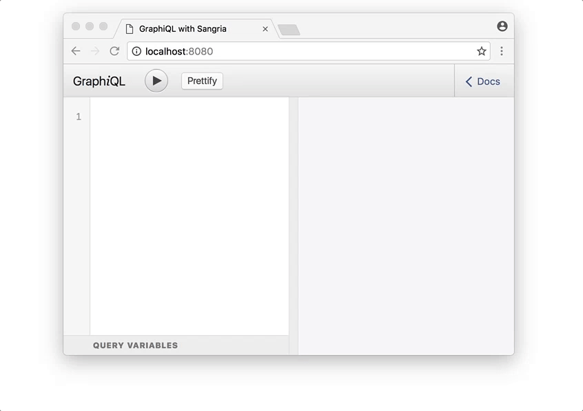

title: GraphQL
author:
  name: Raúl Hernández
  twitter: raulghm
  url: https://github.com/raulghm
output: index.html
controls: true
style: style.css
theme: juanbrujo/cleaver-beerjs

--

# GraphQL
## query language for your API

--

# El problema

<div class="u-alignCenter">
	
</div>

--

<div class="u-alignCenter">
	
</div>

--

<div class="u-alignCenter">
	
</div>

--

<div class="u-alignCenter">
	
</div>

--

# GraphQL
# Como solución

--


# Since 2012

<div class="u-alignCenter">
	Creado por Facebook el 2012. Uso interno y liberado en 2015.
</div>


--

# Over-fetching / under-fetching

<div class="u-alignCenter">
	
</div>

--

# Ask for what you need, get exactly that

<div class="u-alignCenter">
	
</div>

--

# Core concepts

--

# The Schema Definition Language (SDL)

Person

```
type Person {
  name: String!
  age: Int!
}
```

Post

```
type Post {
  title: String!
  author: Person!
}
```

--

# Query

Query

```
{
  allPersons {
    name
  }
}
```

Response

```
{
  "allPersons": [
    { "name": "Johnny" },
    { "name": "Sarah" },
    { "name": "Alice" }
  ]
}
```

--

# Mutation
## create

```
mutation {
  createPerson(
  	name: "Jorge"
  	age: 30
  ) {
    name
    age
  }
}
```

Response

```
{
	"createPerson": {
	  "name": "Jorge",
	  "age": "30",
	}
}
```

--

# Mutation
## update

```
mutation {
  uodatePerson(
  	id: "10"
  	name: "Leo"
  ) {
    id
  }
}
```

Response

```
{
	"updatePerson": {
	  id: "10"
	}
}
```

--

# Mutation
## delete

```
mutation {
  deletePerson(
  	id: "10"
  ) {
    id
  }
}
```

Response

```
{
	"deletePerson": {
	  id: "10"
	}
}
```

--

# Apollo Client

* Vue-apollo
* React-apollo
* iOS
* Android
* ...

--

# One more thing...

--

# Graph.cool

<div class="u-alignCenter">
	
</div>

--

# Graph.cool

* CLI
* Auth
* Data import
* Deployment 
* Functions

--

# Resources

* http://graphql.org 
* https://www.howtographql.com
* https://graph.cool